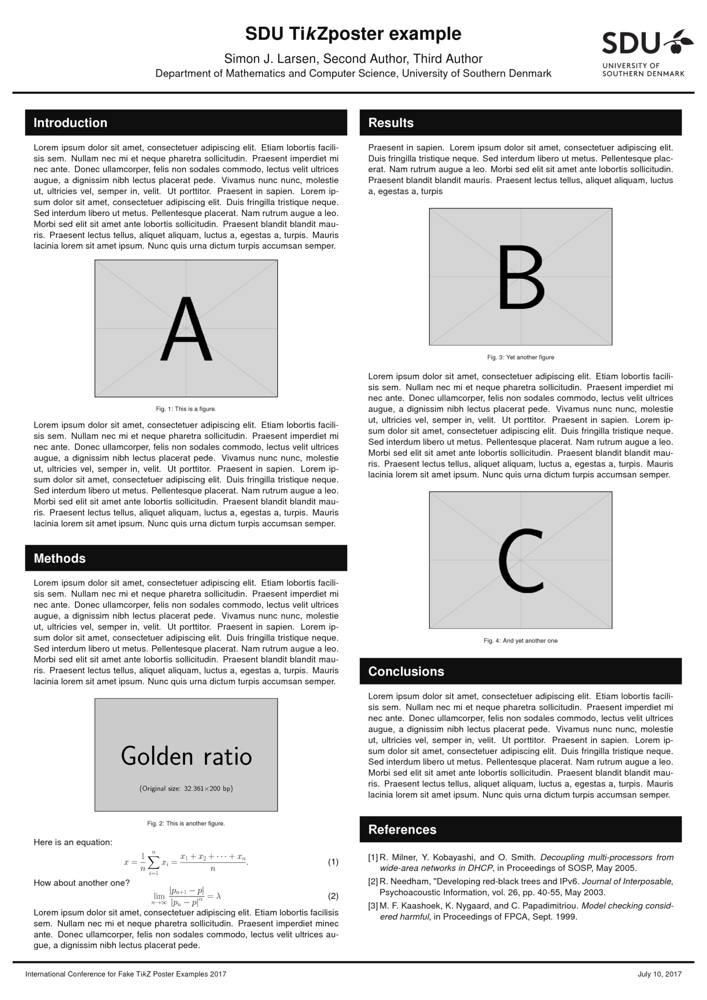

tikzposterSDU
=============

A TikZposter theme based on the style guide of the University of Southern Denmark.

## Installation

Download `tikzposterSDU.sty` at place it in the same folder as your root document. The Arial font used in the example is non-free. If it was not included with your LaTeX distribution you can download it using the [getnonfreefonts](https://www.tug.org/fonts/getnonfreefonts) script.

## Usage

```latex
\documentclass{tikzposter}

\usepackage{tikzposterSDU}
\usetheme{SDU}

\usepackage{uarial}
\renewcommand{\familydefault}{\sfdefault}

\title{A minimal example}
\author{Simon J. Larsen}
\institute{University of Southern Denmark}
\date{\today}
\conference{Conference name}
\logoleft{}
\logoright{\includegraphics[width=11cm]{sdulogo.pdf}}

\begin{document}
\maketitle
\end{document}
```

## Example poster



